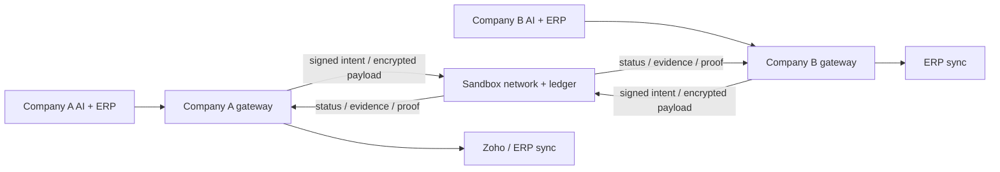

# POC
Proof of Concept for a decentralized interoperable trade data exchange network for Indian domestic B2B traders.

## Status

**Current status:** working prototype v0.2. The repo now includes a validated protocol layer, a hosted sandbox network, a Zoho-first ERP adapter, and a sovereign-company AI gateway pattern for cross-company communication.

This project is no longer only a blueprint. It now demonstrates the core building blocks needed for a real sandbox integration path:

- canonical document model
- end-to-end encrypted document exchange
- bilateral append-only ledger prototype
- HTTP-hosted sandbox network for online integration
- ERP adapter for Zoho Books invoice sync
- company-owned AI gateway with signed intent validation and policy enforcement

## Architecture

The network is decentralized infrastructure for B2B trade-document exchange and triple-entry accounting. Counterparties sign a shared accounting event, verify the same event, and derive their respective books from it. The ledger remains append-only: corrections, reversals, and disputes are new events, never edits to accepted history.

The exchange and ledger are one logical network with distinct privacy boundaries:

- **Ledger plane:** signed events, commitments, proofs, and derived status provide shared tamper-evident accounting history.
- **Data plane:** end-to-end encrypted documents are transmitted between authorized counterparties. Relays and storage nodes do not receive decryption keys by default.
- **Verification plane:** businesses and partner systems grant scoped permissions to third parties, ERP systems, and AI gateways without unrestricted access to all data.
- **AI gateway plane:** each company runs its own agent gateway, which converts local AI actions into signed, policy-scoped intents before they interact with the shared network.

## Implemented prototype components

### 1. Canonical trade document protocol

The core model defines a canonical invoice and trade-document schema with strict validation for:

- document identity and revisioning
- participant identity enforcement
- tax total consistency
- fixed currency rules
- canonical serialization for signing and hashing

This is implemented in the core schema and canonicalization modules.

### 2. Private exchange and verification

The system supports:

- participant key generation
- signature verification
- document encryption for the recipient
- ciphertext integrity checks
- controlled decryption and verification by the authorized recipient

This is the foundation for privacy-preserving counterpart communication.

### 3. Bilateral append-only ledger

The legacy ledger proposal path requires both trusted counterparties to sign. A separate native TEA lifecycle now supports a seller-signed submission followed by a counterparty acceptance or dispute. The submitted event is provisional; only the counterparty can transition it to confirmed. Events are hash chained and append-only. This remains an in-memory prototype, not a distributed consensus service.

Semantic invoice and credit-note transactions derive balanced posting sets for each participant, including tax component postings. The full transaction is represented by a salted commitment in the shared event; the recipient can decrypt the source invoice, independently derive the same transaction, and verify that commitment before signing acceptance. The network verifies signatures and lifecycle transitions, not the economic truth of the source data or accounting interpretation.

Amounts in this pilot are denominated in INR paise; the protocol does not issue a currency or settle payments. Zoho major-unit decimals are converted exactly to paise, and invoices with unsupported currencies or tax totals that cannot be reconciled to named GST components are rejected.

### 4. Hosted sandbox network

A single-process, in-memory HTTP sandbox is available for controlled integration testing. It binds to `127.0.0.1:3000` by default and exposes endpoints for:

- public-key-only participant registration and lookup
- submission of participant-encrypted, signed envelopes
- legacy bilateral ledger proposal submission and lookup
- TEA lifecycle event submission and lookup (`/tea/events`, `/tea/transactions/{id}`)
- a minimal health check

The server does not receive plaintext documents through the envelope endpoint. Participant gateways must encrypt and sign the envelope before submission. Request bodies are limited to 1 MiB by default, and responses are marked non-cacheable. When an API token is configured, every route except health requires its bearer token. Binding outside loopback requires both a bearer token of at least 32 bytes and TLS certificate/key files. Browser origins are not allowed by default. This sandbox is not production-ready: its state is lost on restart, and production identity governance, durable storage, rate limiting, and monitoring remain outstanding.

### 5. Zoho-first ERP integration

The Zoho Books-oriented adapter now:

- fetches and maps an invoice to the canonical document and balanced semantic posting sets
- creates and submits the encrypted envelope using the seller's locally supplied key material
- submits a seller-signed provisional TEA event and updates ERP metadata to `pending_counterparty`
- allows a buyer gateway to verify the salted commitment and append a signed acceptance or dispute

The end-to-end flow is tested with a fake Zoho HTTP service. Live Zoho OAuth/API compatibility and updating the seller ERP after a later counterparty decision remain future work.

An interactive, browser-only [Zoho acceptance/dispute workflow mock](docs/zoho-tea-review-mock.html) demonstrates the seller and buyer views. Its controls are simulated and do not call Zoho or the network.

### 6. Sovereign AI agent gateways

The project now includes a company-owned AI gateway model that is designed for multi-company participation. Each gateway:

- is associated with a company and participant identity
- signs outbound intents with the participant key
- verifies inbound signed requests
- authorizes only actions allowed by local policy
- restricts documents, recipients, and scopes to permitted values

This is the recommended pattern for cross-company AI communication when each company owns its own infrastructure and data boundary.

## Recommended communication pattern for AI + ERP + network

The optimum pattern is not to let AI systems directly act as network peers. Instead:

1. Each company runs its own AI gateway inside sovereign infrastructure.
2. The gateway converts AI decisions into signed, policy-scoped intents.
3. The shared network validates scope, identity, and signature.
4. Only approved events are appended to the ledger or exposed to counterparties.
5. ERP systems and downstream processes receive event updates through a webhook, queue, or API callback.

This keeps the AI inside the company trust boundary while still enabling secure interoperability.

## Local development and verification

Install dependencies:

npm install

Run tests:

npm test

Run TypeScript build:

npm run build

Run the sandbox locally (loopback only by default):

npm run sandbox

## One-click MVP demo

A browser demo drives one complete B2B trade transaction end-to-end through the
live sandbox — Kerala Industrial Supplies Pvt Ltd (seller) sends invoice
INV-2026-0001 (₹94,400) to Hyderabad Manufacturing Pvt Ltd (buyer):

npm run demo

Then open http://127.0.0.1:8080 and press **START DEMO**. The demo fetches the
invoice from a mocked Zoho Books endpoint on the seller side, maps it to the
canonical trade document, signs it (Ed25519), encrypts it to the buyer
(X25519 sealed box), submits the envelope over HTTP to the real
`HostedTradeNetwork`, appends a seller-signed provisional TEA event with a
salted accounting commitment, then has the buyer pull, decrypt, verify,
independently re-derive the posting sets, and sign acceptance — moving the
transaction to CONFIRMED on the hash-chained ledger. Signed, policy-scoped AI
gateway intents wrap both sides of the exchange. **RESET DEMO** rebuilds keys,
network state and ledger for another run.

No step is simulated: every hash, signature, ciphertext and ledger event shown
in the UI is produced by the actual protocol code in `src/`. The UI is a small
React/TypeScript app in `ui/` (built with `npm run build:ui`), served by the
demo server in `src/demo/` alongside a server-sent event stream at
`/api/demo/stream`.

For a controlled remote sandbox, configure a long random API token and TLS certificate/key before binding beyond loopback:

HOST=0.0.0.0 NETWORK_API_TOKEN='replace-with-a-random-token-at-least-32-bytes' TLS_CERT_PATH='/path/to/cert.pem' TLS_KEY_PATH='/path/to/key.pem' npm run sandbox

Do not use company private keys with the hosted process. Generate keys and create signed, encrypted envelopes inside participant-controlled gateways. The sandbox is in-memory and must not be treated as a production ledger service.

## Build sequence and status

The current project has already completed the following milestones:

1. **Protocol and threat model:** canonical schema, signatures, privacy boundaries, and validation logic.
2. **Private exchange:** encrypted document flow and recipient verification.
3. **Native TEA lifecycle prototype:** balanced semantic postings, provisional submission, and signed counterparty decision in a single-process hash-chained log.
4. **Sandbox hosting:** live network layer for external integration.
5. **ERP integration:** Zoho-first invoice import and ledger update path.
6. **Sovereign AI integration:** company-owned gateway and signed intent policy model.

## Open architecture decisions

These remain important for the next production-ready phase:

- validator participation model and finality assumptions
- scope of field visibility across counterparties and verifiers
- delegated authority rules for AI and ERP systems
- retention and deletion obligations for signed ledger history
- operational security for cross-company webhook and queue integrations
- production OAuth and identity setup for ERP providers such as Zoho

## Full blueprint

See the [full architecture blueprint](ARCHITECTURE_BLUEPRINT.md) and [PDF version](ARCHITECTURE_BLUEPRINT.pdf) for the broader design and governance context.
