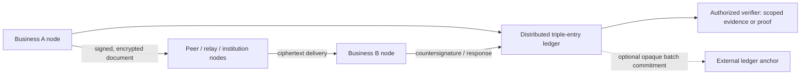

# POC
Proof Of Concept of decentralized interoperable trade data exchange network for Indian domestic b2b traders

## Architecture

**Status:** First blueprint, draft v0.1. This architecture is intended to be refined through threat modeling, protocol design, and pilot testing.

The network is decentralized infrastructure for B2B trade-document exchange and **triple-entry accounting**. Counterparties sign a shared accounting event, verify the same event, and derive their respective books from it. The ledger is append-only: corrections, reversals, and disputes are new events, never edits to accepted history.

The exchange and ledger are one logical network with distinct privacy boundaries:

- **Ledger plane:** replicated signed events, commitments, proofs, and derived status provide shared tamper-evident accounting history.
- **Data plane:** end-to-end encrypted documents and attachments are delivered and replicated for authorized parties. Relays and storage nodes do not receive decryption keys by default.
- **Verification plane:** businesses grant named third parties scoped permission to verify authenticity or selected claims without unrestricted access to documents or ledger data.

Encryption protects document contents, but does not hide routing metadata such as relationships, timing, message size, or frequency. The design minimizes metadata and makes its visibility an explicit decision. It cannot protect against every compromised endpoint, key, or authorized recipient.

### Node classes

Node class describes operational role and resource profile. It does not automatically grant plaintext access, validator rights, or governance authority.

| Class | Role | Boundary |
|---|---|---|
| **Mother** | Bootstrap, signed network configuration, discovery, protocol distribution, health | Replicated across operators; no root authority or default trade-content access |
| **Institution** | High-availability relay/storage, possible validator, institutional integrations | Ciphertext and only the ledger view permitted by policy |
| **Professional** | Business/service-provider node, ERP connector, document workflow, ledger verification | Reads only records its operator is authorized to access |
| **Light** | Mobile, browser, or constrained participant using peers and relays | Verifies relevant events; does not blindly trust relays for integrity |

Validator membership, bootstrap services, and business-identity issuance are separate roles. No single mother node or institution should become a hidden point of control.

### Triple-entry event flow

1. A business creates and validates a canonical document revision locally.
2. It signs the revision, encrypts the document for its recipient, and submits a ledger event bound to that revision.
3. Relays deliver or replicate ciphertext. Validators check authorization, signatures or proofs, idempotency, and allowed state transitions using only their permitted view.
4. The recipient decrypts and verifies the document, then accepts, rejects, or disputes it. Acceptance adds its countersignature.
5. At the defined finality threshold, both businesses verify the shared event and derive their accounting entries.
6. Corrections and disputes append new events; accepted history is not rewritten.

The immutability target is append-only, tamper-evident history under explicit consensus and governance assumptions, not a claim that data can never be changed under any failure. Payload retention is separate: a permanent commitment may outlive encrypted replicas or decryption keys, so retention and erasure obligations need legal review.

### Privacy and third-party verification

The initial exchange should use end-to-end encryption, participant-controlled signing keys, authenticated key discovery, rotation/revocation, canonical serialization, randomized commitments for sensitive values, encrypted backups, and replay protection. Plaintext and keys must not appear in relays, logs, analytics, or default telemetry.

Zero-knowledge proofs (ZKPs) are a targeted later capability, not a replacement for encryption. They may prove a defined claim, such as a tax calculation following a rule or a receivable meeting lender criteria, without revealing every input. A proof validates a computation over supplied inputs; it does not prove the inputs are true. Start with signatures, encryption, commitments, and selective disclosure; add ZK only for a concrete workflow.

A business may issue a signed grant to a named verifier, scoped by records or claims, fields, purpose, expiry, and onward-disclosure policy. Verification can range from authenticity checks to selected-field disclosure, a proof, or full document access. Revocation stops future access but cannot retract information already copied. Disclosing counterparty-confidential fields may require both businesses' consent.

### Ledger strategy and integrations

The network's own distributed ledger is the authoritative triple-entry system. An external chain is optional, not a way to outsource security. A future integration could anchor opaque batch commitments to make retrospective rewriting more detectable. Do not publish plaintext, guessable document hashes, or unnecessary business metadata. Evaluate candidates for validator independence, finality, privacy leakage, governance, availability, cost, and migration options.

Use a canonical document model with versioned profiles for GST e-invoice/e-way bill and future ERP, ONDC/Beckn, OCEN, and EDIFACT integrations. External services are disclosure boundaries: data sent to them is visible to those providers. Prefer ERP adapters in participant-controlled professional nodes or local agents, with narrowly scoped credentials.

### Build sequence

1. **Protocol and threat model:** define field visibility, node capabilities, identity/key lifecycle, validator assumptions, finality, and retention.
2. **Private exchange:** prove two business nodes can exchange an encrypted document through an untrusted relay and independently verify it.
3. **Distributed ledger:** implement shared event rules, countersignatures, append-only corrections/disputes, multi-operator validation, and recovery tests.
4. **Node classes and governance:** enforce capabilities, independent operation, signed upgrades, and privacy-preserving monitoring.
5. **Third-party verification:** implement scoped grants, authenticity checks, selective disclosure, expiry/revocation, and audit records.
6. **Targeted ZK/anchoring and pilot:** add only for a concrete use case; complete independent security review and operational testing.

### Open architecture decisions

- Permissioned, open, or hybrid validator participation, and the fault/collusion threshold required for finality.
- What each field reveals to counterparties, validators, other participants, and verifiers; whether GSTIN is visible or selectively disclosed.
- Business identity proofing, delegated signing authority, and acceptable key recovery model.
- Which events require both counterparties to countersign and which can be provisional or unilateral.
- Payload retention, backup, legal hold, and deletion obligations.
- The first third-party verification use case and the specific claim it must prove.
- Measurable requirements that justify ZK proofs or an external-chain anchor.

### Full blueprint

See the [full architecture blueprint](ARCHITECTURE_BLUEPRINT.md) and [PDF version](ARCHITECTURE_BLUEPRINT.pdf). The detailed document includes component boundaries, risks, phase exit criteria, and decisions to resolve before choosing a ledger implementation.
