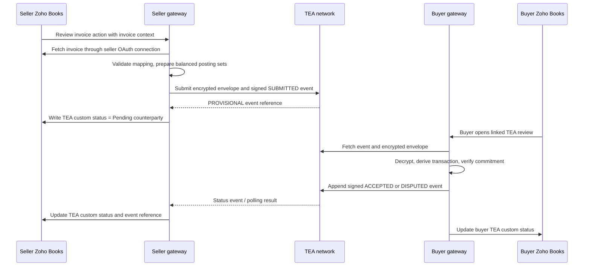

# Zoho Books TEA Extension Plan

## Decision

For the first two-organization pilot, build a **private Zoho Sigma extension** with an invoice-detail action named **Review in Trade Network**. The action should open the TEA review experience as an embedded panel where Zoho Books supports that extension location.

If the target Zoho Books edition or invoice page does not support the required embedded surface, use the same private extension action to open a hosted review page. The page must receive a short-lived, single-use launch context from the backend, not Zoho OAuth tokens or participant keys in its URL.

Do not publish to the public Zoho Marketplace for the initial pilot. Marketplace publication adds review, support, and distribution obligations before the workflow is validated.

## Product Boundary

- Zoho Books remains the system of record for each company's own invoice and double-entry books.
- The TEA service stores a shared counterparty event and its lifecycle: provisional submission, counterparty acceptance, or dispute.
- The extension is a user interface and launcher. Company-controlled gateways retain Zoho OAuth credentials and participant signing keys.
- The network records INR-denominated accounting values only. It issues no currency and uses no external blockchain.
- A TEA state must not overwrite Zoho's native invoice/payment state. Store it in a dedicated custom field or related TEA record.

## Phases

### Phase 0: Zoho platform and API spike

Before committing to an extension surface, verify it against the actual pilot Zoho Books edition and two test organizations.

- Confirm Sigma supports a private extension and an invoice-detail action in the target edition.
- Confirm whether the action can show an embedded panel; retain the hosted-page fallback if not.
- Verify the real Books OAuth authorization/refresh flow, least-privilege scopes, invoice read operation, custom-field update operation, and webhook or polling options.
- Inspect representative Zoho invoice payloads for currency precision and tax component naming. The adapter must reject unknown tax classifications rather than guess.
- Decide how a buyer finds the shared transaction: extension inbox, signed notification, or polling by registered participant and document reference.

**Exit criteria:** an admin can install a private test extension, authorize one test organization, open a known invoice context, and read it using the documented Zoho API.

### Phase 1: Review interaction prototype

- Build a clickable mock for seller and buyer views.
- Show invoice totals, classified taxes, source organization, TEA status, event history, and the commitment verification result.
- Require the buyer to confirm review before enabling acceptance.
- Make dispute reason and evidence required; explain that dispute is a new event and does not rewrite the submission.
- Keep this prototype explicitly labeled as simulated until connected to the gateway.

**Exit criteria:** users can explain what the seller submits, what the buyer verifies, and how acceptance differs from Zoho payment status.

### Phase 2: Private Sigma extension shell

- Package the invoice action and review panel/page using the verified Sigma surface.
- Bind the extension installation to the Zoho organization and the network participant identity.
- Use Zoho-managed OAuth connections where available; otherwise complete OAuth server-side and store refresh credentials in a secrets manager.
- Pass only a validated invoice ID and short-lived launch nonce to the gateway. Never trust an organization ID supplied only by browser code.

**Exit criteria:** installing the extension and connecting an organization works without manually copying access tokens into configuration.

### Phase 3: Gateway and Zoho connector

- Replace the prototype fetch/status contract in `src/erp/zoho.ts` with the real API operations validated in Phase 0.
- Add tenant-aware OAuth refresh, secret rotation, timeouts, structured errors, and audit records that exclude credentials and invoice plaintext.
- Map Zoho decimal amounts exactly to INR paise and require tax components to reconcile.
- Add idempotency keys and retry/reconciliation behavior so a timeout does not create duplicate submissions or duplicate Zoho updates.
- Persist TEA events and delivery jobs before pilot use. The current network and TEA ledger are in-memory and lose state on restart.

**Exit criteria:** retrying the same invoice operation creates no duplicate TEA transaction, and a restart preserves its event/status history.

### Phase 4: Two-party TEA workflow

- Seller reviews the imported invoice and authorizes a signed, encrypted provisional submission.
- Network returns a stable transaction/event reference and the extension writes `Pending counterparty` to a dedicated Zoho custom field.
- Buyer opens the matching transaction, decrypts the invoice locally, derives the semantic posting sets, and verifies the salted commitment before deciding.
- Buyer signs `ACCEPTED` or `DISPUTED`; a dispute includes a reason code and evidence reference.
- Both company gateways update their own Zoho organization with the latest TEA state. Keep the native invoice state untouched.
- Deliver status through signed callbacks or bounded polling with deduplication; do not depend on the browser remaining open.

**Exit criteria:** both organizations see the same event history; only the buyer can accept/dispute the seller's provisional event; acceptance and dispute are append-only; and each Zoho record points to the same TEA transaction ID.

### Phase 5: Controlled pilot and release gate

Test at least: successful acceptance, tax mismatch dispute, wrong recipient, invalid/expired launch nonce, revoked key, duplicate callback, OAuth expiry, Zoho rate limit, network timeout, service restart, and recovery. Use synthetic invoices first, then obtain business and security approval before real invoices.

Only consider Marketplace publication after the private pilot, support process, privacy disclosures, security review, and Zoho review requirements are understood.

## Onboarding Flow

1. Each organization's Zoho admin installs the private extension and authorizes its own Zoho connection.
2. The organization links its Zoho organization and business/branch IDs to its network participant identity.
3. The company gateway registers public keys; private signing and encryption keys stay inside that company's infrastructure.
4. The admin maps the TEA status custom field and selects allowed invoice types.
5. A sandbox invoice is submitted, reviewed by the buyer, and accepted or disputed before enabling the workflow for more users.

## Current Gaps and Guardrails

- The current Zoho tests use a fake HTTP service; live OAuth and API compatibility are unverified.
- The existing status-update endpoint is a prototype contract, not evidence that Zoho exposes that exact route.
- The hosted network is a single-process in-memory service, not production storage or distributed consensus.
- The current invoice schema and mapper initially support INR and classified Indian GST only.
- The extension must not place static network bearer tokens, Zoho access tokens, private keys, or decrypted invoices in browser storage, URL parameters, analytics, or logs.
- Do not treat a Zoho invoice as paid merely because its TEA transaction is accepted. Payment settlement remains a separate workflow.

## First Implementation Slice

After the Phase 0 spike, implement the private invoice action and gateway launch flow for one seller Zoho organization. Keep the hosted review page as a fallback surface, connect it to the existing `SUBMITTED`/`ACCEPTED`/`DISPUTED` event API, and use custom TEA status fields. Add the buyer organization and asynchronous status updates only after the seller-side OAuth, invoice mapping, and idempotency path passes sandbox tests.